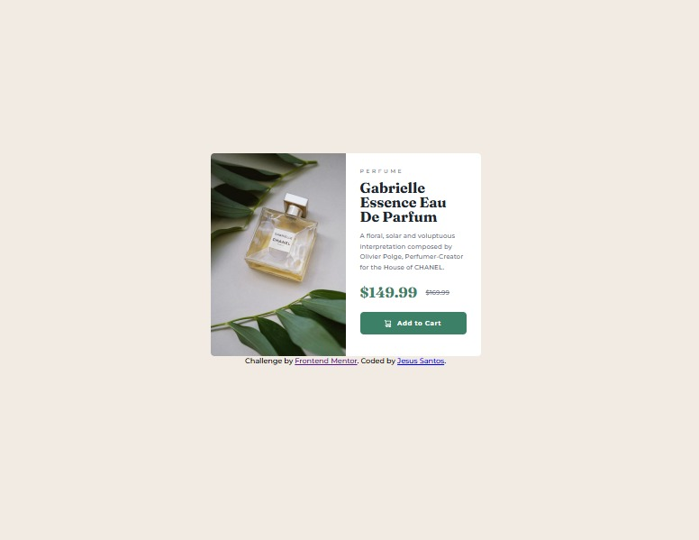

# Frontend Mentor - Product preview card component solution

This is a solution to the [Product preview card component challenge on Frontend Mentor](https://www.frontendmentor.io/challenges/product-preview-card-component-GO7UmttRfa). Frontend Mentor challenges help you improve your coding skills by building realistic projects. 

## Table of contents

- [Overview](#overview)
  - [The challenge](#the-challenge)
  - [Screenshot](#screenshot)
  - [Links](#links)
- [My process](#my-process)
  - [Built with](#built-with)
  - [What I learned](#what-i-learned)
  - [Continued development](#continued-development)
- [Author](#author)

## Overview

### The challenge

Users should be able to:

- View the optimal layout depending on their device's screen size.
- See hover and focus states for interactive elements.

### Screenshot



### Links

- Solution URL: [GitHub Repository](https://github.com/jesussantos210/product-preview-card)
- Live Site URL: [Live Site](https://jesussantos210.github.io/product-preview-card/)

## My process

### Built with

- Semantic HTML5 markup
- CSS custom properties (Variables)
- Flexbox
- Mobile-first workflow
- Responsive Images (`<picture>` tag)

### What I learned

In this project, I learned how to handle responsive images efficiently using the HTML `<picture>` tag to switch between different image files based on the screen size. I also reinforced my understanding of Flexbox for switching layouts from column (mobile) to row (desktop).

I also learned the importance of proper file paths and syntax debugging in CSS.

Here is a snippet of the responsive image implementation:

```html
<picture>
  <source media="(min-width: 600px)" srcset="images/image-product-desktop.jpg">
  
</picture>
```

And how I managed the desktop layout:

```css
@media (min-width: 600px) {
    .product-card {
        flex-direction: row;
    }
    .product-image-container, .product-content {
        width: 50%;
    }
}
```
## Continued development
For future projects, I want to focus on strict CSS syntax organization and explore CSS Grid for more complex two-dimensional layouts.

## Author
Github - [Jesus Santos](https://github.com/jesussantos210)

Frontend Mentor - [@jesussantos210](https://www.frontendmentor.io/profile/jesussantos210)
